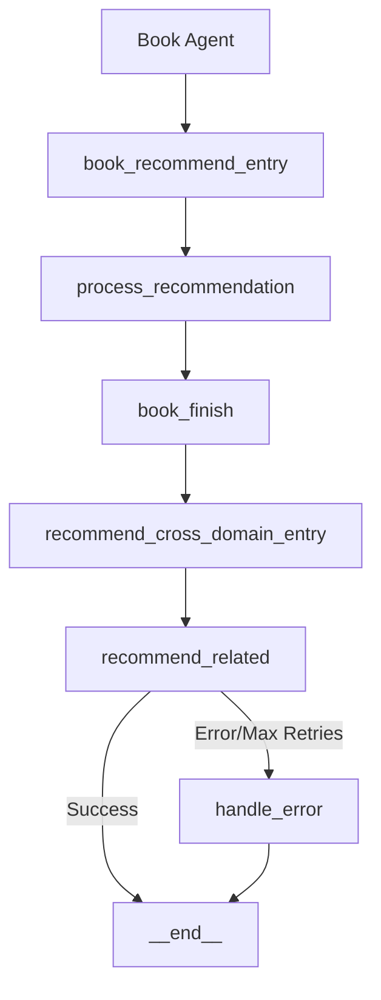

# Workflow Architecture

## Key Components

1. **Book Agent Nodes**
   - `book_recommend_entry`: Initial state validation
   - `process_recommendation`: Core book recommendation logic
   - `book_finish`: Finalizes output and triggers cross-domain flow

2. **Cross-Domain Agent Nodes**
   - `recommend_cross_domain_entry`: Receives validated book selection
   - `recommend_related`: Generates multi-media recommendations with retry logic
   - `handle_error`: Error recovery and logging
   - `__end__`: Built-in langgraph terminal state

## Data Flow
1. Book selection passes through `book_finish` to `recommend_cross_domain_entry`
2. Recommendations generated in `recommend_related` with 3 retry attempts
3. On success, flow terminates at `__end__`
4. On error or max retries, flow passes through `handle_error` to `__end__`

## Error Handling
- Automatic retries (up to 3 attempts) for LLM communication failures
- Validation checks at entry nodes using Pydantic models
- Error node captures stack traces and metrics
- Clear error state propagation through workflow

## State Management
- Book Agent: Uses `BookState` Pydantic model
- Cross-Domain Agent: Uses `CrossDomainState` Pydantic model
- Strict type validation and error checking throughout flow