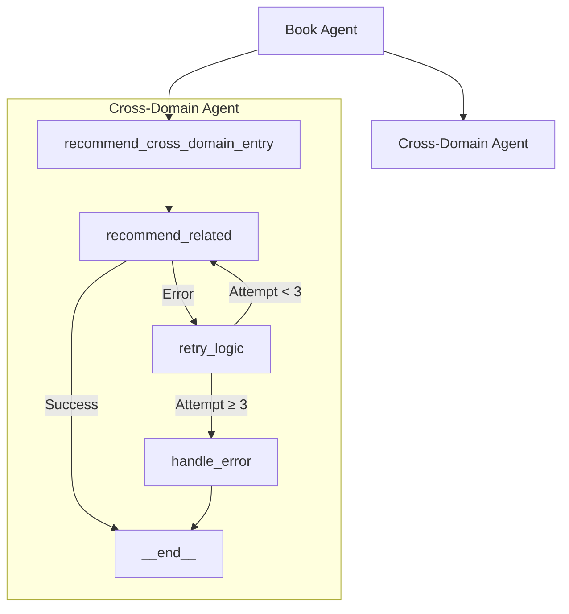
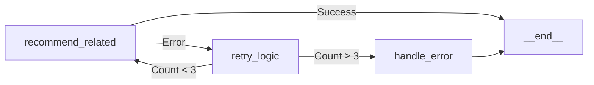

# Cross-Domain Workflow Node Analysis

## Current Node Structure


## ✅ Resolved Issues

1. **Node Registration**
   - ✓ `recommend_cross_domain_entry` properly initialized with state validation
   - ✓ Base class inheritance working correctly with `CrossDomainState`

2. **Edge Configuration**
   - ✓ Clear flow from book agent to cross-domain entry
   - ✓ Error handling properly configured with retry logic
   - ✓ All edges properly connected to langgraph's `__end__` state

3. **State Validation**
   - ✓ Input state structure verified using `CrossDomainState` Pydantic model
   - ✓ Schema validation enforced throughout workflow

## Current Implementation

1. **State Management**
```python
class CrossDomainState(BaseModel):
    selected_book: Dict[str, str]
    retry_count: int = 0
    error: Optional[str] = None
    cross_domain_recommendations: Optional[Dict] = None
    status: Optional[str] = None
```

2. **Error Handling**


3. **Inter-Agent Contract**
```python
# Input State
{
    "selected_book": {
        "title": str,
        "author": str,
        "genre": str,
        "description": str
    }
}

# Output State
{
    "cross_domain_recommendations": {
        "movie": Dict,
        "game": Dict,
        "song": Dict
    }
}
```

All major structural issues have been resolved. The workflow now provides proper state validation, error handling, and clear flow control.