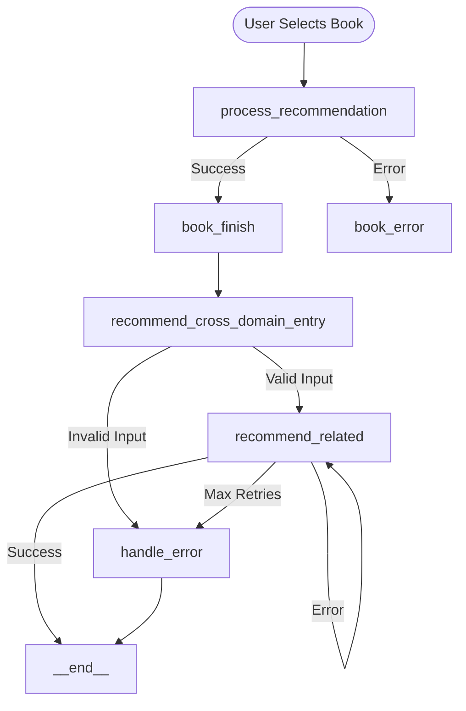

# Cross-Domain Workflow Specification

## Node Relationship Diagram


## State Management
```python
class CrossDomainState(BaseModel):
    """State model for cross-domain recommendations."""
    selected_book: Dict[str, str]
    retry_count: int = 0
    error: Optional[str] = None
    cross_domain_recommendations: Optional[Dict] = None
    status: Optional[str] = None
```

## Node Configuration
```python
# Initialize workflow with Pydantic state model
workflow = StateGraph(CrossDomainState)

# Register core nodes
workflow.add_node("recommend_cross_domain_entry", recommend_cross_domain_entry)
workflow.add_node("recommend_related", recommend_related_content)
workflow.add_node("handle_error", handle_error)

# Configure edges with proper error handling
workflow.add_conditional_edges(
    "recommend_cross_domain_entry",
    lambda state: "recommend_related" if not state.error else "handle_error",
    {
        "recommend_related": "recommend_related",
        "handle_error": "handle_error"
    }
)

workflow.add_conditional_edges(
    "recommend_related",
    lambda state: (
        END if state.cross_domain_recommendations
        else "handle_error" if state.error or state.retry_count >= 3
        else "recommend_related"
    ),
    {
        "handle_error": "handle_error",
        "recommend_related": "recommend_related",
        END: END
    }
)

workflow.add_edge("handle_error", END)
workflow.set_entry_point("recommend_cross_domain_entry")
```

## State Validation
```python
def validate_input_state(state: CrossDomainState) -> bool:
    """Validate the input state has required book information."""
    selected_book = state.selected_book
    required_fields = ["title", "author", "genre", "description"]
    return all(selected_book.get(field) for field in required_fields)
```

## State Schema
| Field | Type | Required | Description |
|-------|------|----------|-------------|
| selected_book | Dict[str, str] | Yes | Book info with title, author, genre, description |
| retry_count | int | No | Default 0, tracks LLM call attempts |
| error | Optional[str] | No | Error message if any |
| cross_domain_recommendations | Optional[Dict] | No | Movie, game, and song recommendations |
| status | Optional[str] | No | Current state status (e.g., "error") |

## Error Handling
- Input validation at entry point
- Automatic retries for LLM failures (max 3 attempts)
- Error state propagation through workflow
- All error paths terminate at langgraph's `__end__` state